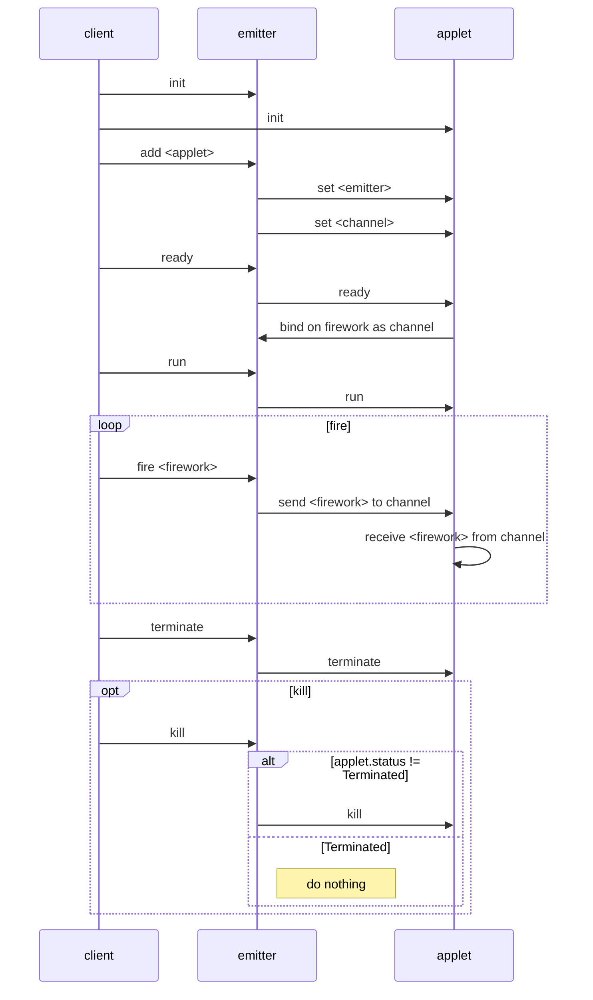

```mermaid
sequenceDiagram

client->>emitter: init
client->>applet: init

client->>emitter: add <applet>
emitter->>applet: set <emitter>
emitter->>applet: set <channel>

client->>emitter: ready
emitter->>applet: ready
applet->>emitter: bind on firework as channel

client->>emitter: run
emitter->>applet: run

loop fire
  client->>emitter: fire <firework>
  emitter->>applet: send <firework> to channel
  applet->>applet: receive <firework> from channel
end

client->>emitter: terminate
emitter->>applet: terminate

opt kill
	client->>emitter: kill
	alt applet.status != Terminated
		emitter->>applet: kill
	else Terminated
		note right of emitter: do nothing
	end
end

```

